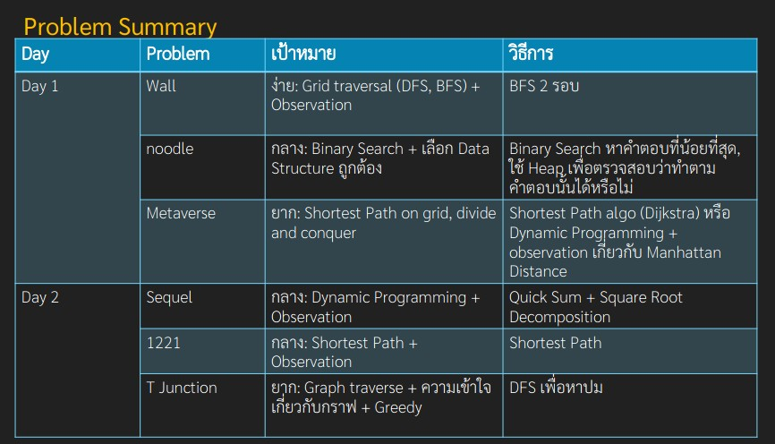

# Review การสอบ และ ข้อสอบ TOI17

## Test Environment

ปีนี้ก็ถือเป็นปีนึงที่มีการพัฒนาขึ้นมาเยอะ

เริ่มที่คอมที่ใช้สอบก่อนเลย ตอนนี้เป็น Ubuntu 20.04 เวอร์ชั่นล่าสุดเรียบร้อยแล้ว ✨✨!

ส่วนโปรแกรม Editor ก็มีครบตั้งแต่ Atom Emacs Eclipse VIM Sublime Text และที่สำคัญ

ในที่สุดก็มี **VSCode** แล้ว!

~~แต่ก็ยังขาด RGB Mechanical Keyboard ไปอยู่ดี ถ้ามีจะดีมาก~~

## เฉลยจากผู้จัดการแข่งขัน



## รีวิววันแรก

สั้นๆ ... ยับ

Score = 92/300 (บอกแล้วว่ายับมาก)

อันดับถ้าคิดเฉพาะวันแรกก็คืออดได้เหรียญ แต่ดีที่มีแข่งสองวัน

### wall - 92/100

ข้อนี้เป็น Flood Fill (หรือ DFS/BFS แล้วแต่ใครจะเรียก)

สาเหตุที่ไม่ได้ 100: Time Limit Exceeded

เดาว่าน่าจะช้าตอนรับ Input เพราะเล่นเขียนแบบนี้

```cpp
cin >> s[i];
s[i] = '.' + s[i] + '.';
```

**Time Complexity**: O(RC)

### noodle - 0/100

ข้อนี้จะเป็น Binary Search + Min Heap / Priority Queue

เป็นข้อที่ง่ายมากๆ ง่ายจริงๆ แต่เสียดายว่าทำไมถึงมองไม่ออก!

### metaverse - 0/100

มันคือข้อกันเต็ม เอาไปให้ใครทำวะ

## รีวิววันที่สอง

ดีขึ้นมาหน่อย ได้ไป 245 จาก 300 _แบบงงๆ_ งงจริง

### sequel - 100/100

#### Solution 1: Brute Force - 22 คะแนน

ก็เขียนตรงๆไปเลย ได้ไป 22 คะแนน

#### Solution 2: Brute Force เหมือนกัน แต่ได้ 100 คะแนน

แค่เพิ่มตรง ดักกรณี M = 1 ให้ไปใช้ Quicksum (Dynamic Programming) แทน แค่นี้ก็ได้ 100 เต็มแล้ว _ก็งงสิ_

**My Time Complexity**: O(NQ) ซึ่งไม่น่าทัน แต่ส่งแล้วได้ 100 ก็แสดงว่าได้แหละ

### 1221 - 45/100

ข้อนี้จะเป็น Floyd-Warshall Algorithm ที่ต้องดัดแปลงนิดหน่อยให้เก็บจำนวนครั้งที่เดินทางด้วย

(ปล. บางคนใช้ Dijkstra N รอบ ก็ทำได้เหมือนกัน ถ้าใจศรัทธา)

```cpp
int newWeight = floyd[i][m].first + floyd[m][j].first;
int newLen = floyd[i][m].second + floyd[m][j].second;

if (newWeight < floyd[i][j].first ||
    (newWeight == floyd[i][j].first && newLen > floyd[i][j].second)) {
    floyd[i][j] = {newWeight, newLen};
}
```

สาเหตุที่ไม่ได้ 100: Wrong Answer

_งง ผิดได้ไง? เขียนตาม YouTube แล้วก็ยังผิด_

**Time Complexity**: O(N³)

**Space Complexity**: O(N²)

### tjunction - 100/100

วิธีที่คนออกโจทย์ต้องการก็ตามข้างบน

แต่วิธีที่เราใช้คือ Binary Search + DFS

โดยวิธีการตรวจสอบว่าคำตอบถูกต้องไหม คือทำการ Depth First Search (ตั้งเงื่อนไขว่าถ้าเจอทางแยก ไปทางที่น้ำหนักน้อยกว่าก่อน) แล้วจับน้ำหนักแต่ละ Edge เข้า Array

เมื่อได้ Array ที่เต็มไปด้วยตัวเลขแล้ว ก็ทำคล้ายๆข้อ noodle เลย

_ซึ่งไม่น่าจะถูก แต่ส่งไปแล้วได้ 100 ก็ถูกแหละ_

**My Time Complexity**: O(NlogR) where R = Right Boundary of Binary Search, in this case, it is summation of weight of all edges
